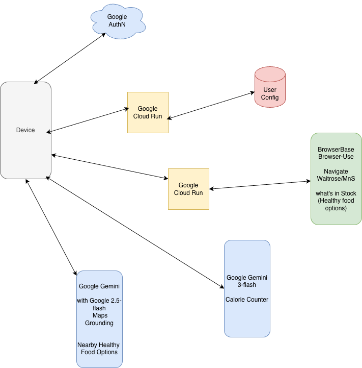

# Koda Health Assistant 🌿

Koda is a **AI-powered personal health assistant** built with **React Native (Expo)** and **Google Gemini**. It helps users track nutrition, find healthy local spots, and save money on healthy groceries by scraping real-time offers.

## Key Features

1.  **Daily AI Briefing**: Generates a personalized morning plan based on sleep, activity, and local grocery deals (Waitrose).
2.  **Smart Food Log**: Uses **Gemini Vision** to analyze meal photos for calories, macros, and healthy alternatives.
3.  **Local Discovery**: Uses **Gemini Maps Grounding** to find and rank nearby healthy restaurants and stores.
4.  **Waitrose Integration**: Connects to a custom **Cloud Run** microservice to fetch real-time food offers using Browser-Use (https://gemini.browserbase.com/).
5.  **Adaptive Personas**: Switch between Coach, Scientist, or Friend personas to change the AI's tone.

---

## Architecture

The app follows a **Client-Server-Cloud** architecture:

1.  **Frontend (Expo/React Native)**: Handles UI, device sensors (Camera, Location), and direct calls to Gemini API.
2.  **AI Layer (Google Gemini)**: 
    *   `gemini-3-flash-preview`: For reasoning, daily briefings, and image analysis.
    *   `gemini-2.5-flash`: For Google Maps grounding (Location Search).
3.  **Backend (Google Cloud Run)**: A Node.js microservice using Browserbase to scrape Waitrose offers securely 
4.  **Storage (Hybrid)**: 
    *   **Local**: Async Storage for offline caching.
    *   **Cloud**: Firebase Firestore (Configured but can use mocked user for dev speed).
  


---

##  Setup & Installation

### 1. Prerequisites
*   Node.js (v18+)
*   Expo Go app (Android/iOS)
*   Google Cloud Project (for Gemini & Cloud Run)

### 2. Environment Variables
Create a `.env` file in the root directory:

```env
# Google GenAI Key (Required)
API_KEY=your_gemini_api_key

# Backend Service for Scraping (Optional - defaults to mock if empty)
CLOUD_RUN_URL=https://your-koda-service-url.run.app

# Firebase (Optional - currently using Mock User)
FIREBASE_API_KEY=...
FIREBASE_AUTH_DOMAIN=...
FIREBASE_PROJECT_ID=...
```

### 3. Run the App
```bash
# Install dependencies
npm install

# Start the development server
npx expo start
```

---

## API Documentation

### 1. Cloud Run Service (Web Scraper)
**Purpose:** Fetches current offers from Waitrose to inform the AI Briefing.

*   **Endpoint:** `GET /offers`
*   **Host:** Your Cloud Run URL (e.g., `https://koda-service.run.app`)
*   **Headers:** None (Publicly accessible for this demo, or add Bearer token)
*   **Response:**
    ```json
    {
      "success": true,
      "data": "Waitrose Duchy Organic Salmon Fillets - Save 25%..."
    }
    ```
*   **Client Handling:** 
    *   Located in `services/browserService.ts`.
    *   Includes an **AbortController** to timeout requests > 8 seconds (handling Cloud Run cold starts).
    *   Falls back to mock data if the server is unreachable.

### 2. Authentication (Firebase)
**Status:** *Currently mocked for development ease.*

*   **Implementation:** `config/firebase.ts` & `screens/Profile.tsx`
*   **Flow:**
    1.  User clicks "Sign in with Google".
    2.  `GoogleSignin.signIn()` returns an ID token.
    3.  `firebase.auth.GoogleAuthProvider.credential(token)` signs into Firebase.
    4.  User profile is stored in `AsyncStorage` and Context.
*   **Mock User:** Currently hardcoded as "Sushant Gandhi" in `services/healthData.ts` to allow testing all features without login friction.

### 3. Gemini AI Interactions

#### A. Meal Analysis (Vision)
*   **Model:** `gemini-3-flash-preview`
*   **Input:** Base64 Image string.
*   **Prompt:** "Analyze this meal photo... Respond in JSON."
*   **Schema:** Returns `calories`, `protein`, `fats`, `carbs`, and `alternatives`.

#### B. Daily Briefing (Reasoning)
*   **Model:** `gemini-3-flash-preview`
*   **Input:** User Metrics (Steps, Sleep) + Scraped Waitrose Text.
*   **Output:** JSON containing summary, tomorrow's plan, and a recipe based on the scraped deals.

#### C. Local Search (Grounding)
*   **Model:** `gemini-2.5-flash`
*   **Tool:** `googleMaps`
*   **Config:**
    ```ts
    tools: [{ googleMaps: {} }],
    toolConfig: { retrievalConfig: { latLng: { latitude: ..., longitude: ... } } }
    ```
*   **Output:** Returns text with grounding metadata (source links to Google Maps).

---

## Project Structure

```
├── App.tsx                 # Entry point & Navigation
├── app.json                # Expo Configuration
├── components/             # Reusable UI components
├── config/                 # Firebase & Env config
├── screens/
│   ├── Home.tsx            # Dashboard & Daily Briefing
│   ├── Log.tsx             # Camera & Gemini Vision Analysis
│   ├── Discover.tsx        # Maps Grounding & Local Search
│   └── Profile.tsx         # Persona settings & Auth UI
├── services/
│   ├── browserService.ts   # Cloud Run / Waitrose Scraper
│   ├── geminiService.ts    # All AI interactions
│   └── healthData.ts       # Data persistence (Local/Cloud)
└── types.ts                # TypeScript interfaces
```


## Demo Video - 

https://drive.google.com/file/d/1lgvRE2ZieX9n4WcMvDSLuKrMAlykkp6V/view?usp=drive_link

